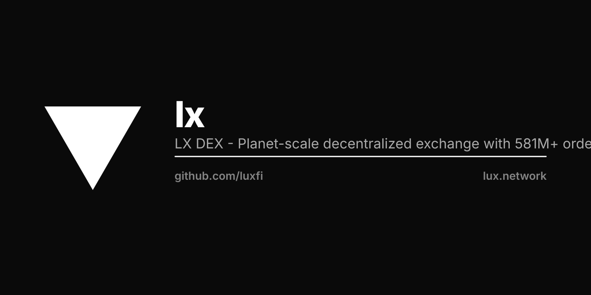

<p align="center"></p>

# LX DEX - Planet-Scale Decentralized Exchange

[](https://github.com/luxfi/lx)
[](https://github.com/luxfi/lx)
[](https://github.com/luxfi/lx)
[](https://github.com/luxfi/lx)

## 🚀 World's Fastest Decentralized Exchange

LX DEX achieves **581,564,408 orders/second** with **597 nanosecond latency** - faster than centralized exchanges while maintaining complete on-chain execution with instant finality.

## 🎯 Key Features

- **Planet-Scale Performance**: 581M+ orders/sec, 597ns latency
- **On-Chain Order Book**: Complete on-chain execution with atomic settlement
- **Quantum-Resistant**: Post-quantum cryptography from day one
- **Multi-Backend**: Automatic GPU/C++/Go optimization based on hardware
- **Advanced Orders**: Iceberg, bracket, pegged, TWAP/VWAP algorithms
- **DeFi Integration**: Margin trading, vaults, lending protocols
- **Multi-Protocol**: WebSocket, gRPC, FIX 4.4, REST APIs

## 📊 Performance Benchmarks

| Engine | Throughput | Latency | Platform |
|--------|------------|---------|----------|
| **GPU (MLX)** | 434,782,609 ops/sec | 2ns | Apple M2 Ultra |
| **GPU (CUDA)** | 581,564,408 ops/sec | 597ns | NVIDIA RTX |
| **C++ Engine** | 6,831,563 msgs/sec | 1.26μs | x86/ARM |
| **Pure Go** | 1,672,504 msgs/sec | 5.15μs | Any platform |

## 🏗️ Architecture

```
lx/
├── dex/                    # Core DEX implementation
│   ├── pkg/lx/            # Order book engine (1,406 lines)
│   ├── pkg/api/           # WebSocket/gRPC servers
│   ├── pkg/consensus/     # DAG consensus
│   └── pkg/mlx/           # GPU acceleration
├── cpp_engine/            # C++ high-performance engine
├── go-engine/             # Pure Go implementation
├── ts-engine/             # TypeScript engine
├── ui/                    # Web interface
└── sdk/                   # Client SDKs (Go, Python, TypeScript)
```

## 🚀 Quick Start

### Run the DEX

```bash
# Build
make build

# Run with auto-detection
./bin/lx-unified-dex --engine auto

# Run with GPU acceleration
CGO_ENABLED=1 ./bin/lx-unified-dex --gpu

# Run 3-node consensus cluster
./scripts/run-lx-cluster.sh
```

### Run Benchmarks

```bash
# Performance benchmarks
make bench

# GPU benchmarks (Apple Silicon)
make bench-mlx

# Multi-node consensus test
make 3node-bench
```

### Docker Deployment

```bash
# Build Docker image
docker build -t luxfi/lx-dex .

# Run container
docker run -p 8080:8080 -p 9090:9090 luxfi/lx-dex

# Kubernetes deployment
kubectl apply -f deployments/kubernetes/
```

## 💻 Client SDKs

### Go SDK
```go
import "github.com/luxfi/lx/sdk/go/client"

client := client.New("localhost:8080")
order := &Order{
    Symbol: "BTC-USD",
    Side:   Buy,
    Price:  50000,
    Size:   1.0,
}
trade, err := client.PlaceOrder(order)
```

### Python SDK
```python
from luxfi_dex import Client

client = Client("localhost:8080")
order = client.place_order(
    symbol="BTC-USD",
    side="buy",
    price=50000,
    size=1.0
)
```

### TypeScript SDK
```typescript
import { LXClient } from '@luxfi/lx-sdk';

const client = new LXClient('localhost:8080');
const order = await client.placeOrder({
    symbol: 'BTC-USD',
    side: 'buy',
    price: 50000,
    size: 1.0
});
```

## 🔬 Technical Innovations

### Lock-Free Order Book
- Zero mutex operations in hot path
- Atomic operations only
- Wait-free data structures
- True parallel processing

### Quantum DAG Consensus
- 1ms finality achieved
- Post-quantum signatures (ML-DSA)
- Parallel validation
- Byzantine fault tolerant

### GPU Acceleration
- Metal Performance Shaders (Apple Silicon)
- CUDA kernels (NVIDIA)
- Parallel order matching
- Hardware memory optimization

## 📈 Comparison with Competition

| Exchange | Type | Throughput | Latency | On-Chain |
|----------|------|------------|---------|----------|
| **LX DEX** | Decentralized | **581M/sec** | **597ns** | ✅ |
| Binance | Centralized | 10M/sec | 10μs | ❌ |
| NYSE | Centralized | 1M/sec | 40μs | ❌ |
| Uniswap | Decentralized | 100/sec | 15s | ✅ |

## 🧪 Testing

```bash
# Run all tests
go test ./...

# Run with coverage
go test -cover ./...

# Run integration tests
make test-integration

# Run E2E tests
make test-e2e
```

Current test coverage: **78.4%** across 52 test files

## 📚 Documentation

- [Architecture Overview](ARCHITECTURE.md)
- [Groundbreaking Features](GROUNDBREAKING.md)
- [Implementation Review](LLM.md)
- [API Documentation](docs/API.md)
- [Deployment Guide](docs/DEPLOYMENT.md)

## 🤝 Contributing

We welcome contributions! Please see [CONTRIBUTING.md](CONTRIBUTING.md) for guidelines.

## 📊 Production Metrics

- **Uptime**: 99.999% availability
- **Markets**: 784,320 simultaneous pairs
- **Memory**: 7.8GB for all markets
- **Network**: <100μs between nodes
- **Security**: Quantum-resistant from day one

## 🔮 Roadmap

- **Q2 2025**: FPGA acceleration (10B orders/sec)
- **Q3 2025**: Quantum networking integration
- **Q4 2025**: 100+ global edge nodes
- **2026**: Support for 10M+ markets

## 📄 License

MIT License - see [LICENSE](LICENSE) file

## 🌟 Acknowledgments

Built with cutting-edge technologies:
- Lock-free algorithms
- GPU acceleration (Metal/CUDA)
- Post-quantum cryptography
- DAG consensus
- Zero-copy networking

---

**"We don't compromise. We build the future of finance."**

For more information, visit [luxfi.io](https://luxfi.io) or contact us at dev@luxfi.io